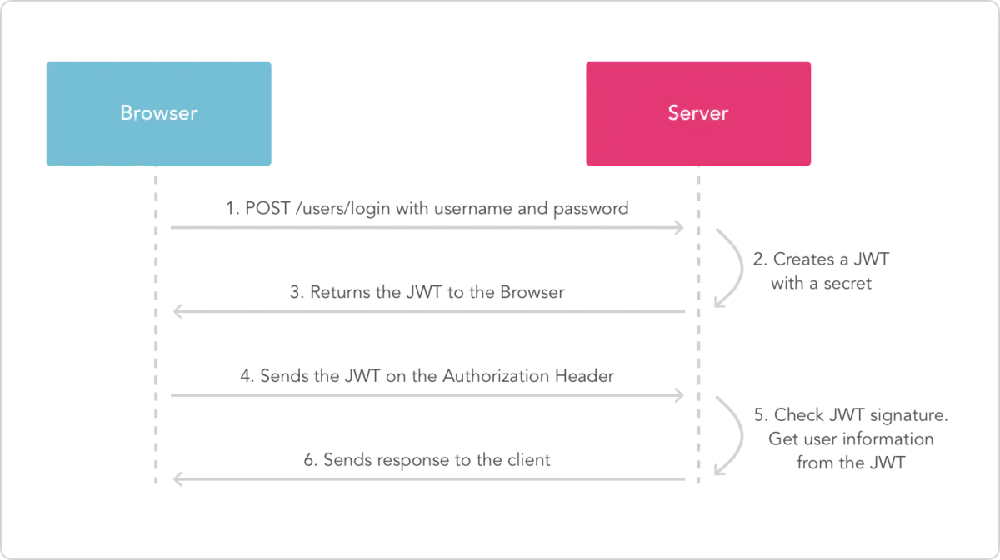

# 目录结构

|             |         |
|-------------|---------|
| common      | 通用模块    |
| sso-center  | SSO授权中心 |
| sso-client  | 客户端 1   |
| sso-client2 | 客户端 2   |

# 认证流程

基于session和基于JWT的方式的主要区别就是用户的状态保存的位置，session是保存在服务端的，而JWT是保存在客户端的。

**基于session的认证流程**

- 用户在浏览器中输入用户名和密码，服务器通过密码校验后生成一个session并保存到数据。
- 服务器为用户生成一个sessionId，并将具有sesssionId的cookie放置在用户浏览器中，在后续的请求中都将带有这个cookie信息进行访问。
- 服务器获取cookie，通过获取cookie中的sessionId查找数据库判断当前请求是否有效。

**基于JWT的认证流程**

- 用户在浏览器中输入用户名和密码，服务器通过密码校验后生成一个token并保存到数据库。
- 前端获取到token，存储到cookie或者local storage中，在后续的请求中都将带有这个token信息进行访问。
- 服务器获取token值，通过查找数据库判断当前token是否有效。

# 优缺点

JWT保存在客户端，在分布式环境下不需要做额外工作。而session因为保存在服务端，分布式环境下需要实现多机数据共享 session一般需要结合Cookie实现认证，所以需要浏览器支持cookie，因此移动端无法使用session认证方案

**安全性**

JWT的payload使用的是base64编码的，因此在JWT中不能存储敏感数据。而session的信息是存在服务端的，相对来说更安全

如果在JWT中存储了敏感信息，可以解码出来非常的不安全

**性能**

经过编码之后JWT将非常长，cookie的限制大小一般是4k，cookie很可能放不下，所以JWT一般放在local storage里面。并且用户在系统中的每一次http请求都会把JWT携带在Header里面，HTTP请求的Header可能比Body还要大。而sessionId只是很短的一个字符串，因此使用JWT的HTTP请求比使用session的开销大得多

**一次性**

无状态是JWT的特点，但也导致了这个问题，JWT是一次性的。想修改里面的内容，就必须签发一个新的JWT

**无法废弃**

一旦签发一个JWT，在到期之前就会始终有效，无法中途废弃。若想废弃，一种常用的处理手段是结合redis

**续签**

如果使用JWT做会话管理，传统的cookie续签方案一般都是框架自带的，session有效期30分钟，30分钟内如果有访问，有效期被刷新至30分钟。一样的道理，要改变JWT的有效时间，就要签发新的JWT。

最简单的一种方式是每次请求刷新JWT，即每个HTTP请求都返回一个新的JWT。这个方法不仅暴力不优雅，而且每次请求都要做JWT的加密解密，会带来性能问题。另一种方法是在redis中单独为每个JWT设置过期时间，每次访问时刷新JWT的过期时间。

**选择JWT或session？**

JWT有很多缺点，但是在分布式环境下不需要像session一样额外实现多机数据共享，虽然seesion的多机数据共享可以通过粘性session、session共享、session复制、持久化session、terracoa实现seesion复制等多种成熟的方案来解决这个问题。但是JWT不需要额外的工作，使用JWT不香吗？且JWT一次性的缺点可以结合redis进行弥补。

# 续签的主流方案
Cookie ＋ JWT 的方式很好的体现了无状态的特点，但由于这种方案下发的 token 是无法管控的，所以在实际应用中一般还是会配合 Redis 使用。

* 方案1：每次请求都返回新的Token，这种简单粗暴，不存在续签的问题，不过相信很多人不会用，请求量大的话性能损耗也是比较明显。
* 方案2：JWT 有效期设置到半夜。
* 方案3：生成的JWT，不加入过期时间，在服务端Redis额外存储一个对应的过期时间，并每次操作延期。这种设计感觉很多余，既然保存到了Redis，JWT从无状态变成了有状态，既然能够保存过期时间，为啥不把用户信息都保存到Redis中，何必用JWT加密后前后端传来传去没有意义。
* 方案4：每次登录的时候生成两个token给前端进行返回，一个是用于鉴别用户身份的token，另外一个token则是用于刷新token用的（jwt生成token，token放入redis中，accessToken过期短，refreshToken过期长）。
* 方案5：临近过期刷新JWT，返回新的Token，很多人也采用的是这种方案。

# 该项目使用的方案

- 生成的token中不带有过期时间，token的过期时间由redis进行管理。
- JWT 中不带有敏感信息，如 password 字段不会出现在 token 中。
- 内存标识记录用户token的过期时间，避免反复查询 redis。临近过期时才去 Redis 刷新过期时间。 

当用户登录之后，后续每个请求都将包含 JWT，一般将 JWT 信息在请求头部携带。单点登录是现在广泛使用的JWT的一个特性，因为它的开销很小，并且可以轻松地跨域使用。

# JWT中token在前端的所有操作
- 获取token
- 将token放到cookie
- 每次发送请求将token存入header
- 解密token，获取用户名等信息存到cookie

# 参考

- https://blog.csdn.net/xiyang_1990/article/details/125078598
- https://blog.csdn.net/desky/article/details/114640840
- https://javaguide.cn/system-design/security/advantages&disadvantages-of-jwt.html#jwt-%E7%9A%84%E7%BB%AD%E7%AD%BE%E9%97%AE%E9%A2%98
- https://www.zhihu.com/question/274566992
- https://zhuanlan.zhihu.com/p/393273628
- https://developer.aliyun.com/article/985710#slide-10
- http://www.javashuo.com/article/p-eddilrqz-y.html
- https://www.cnblogs.com/protected/p/7399159.html
- https://blog.csdn.net/zhang_java_11/article/details/107690042
- https://blog.csdn.net/qq_53126706/article/details/120925322